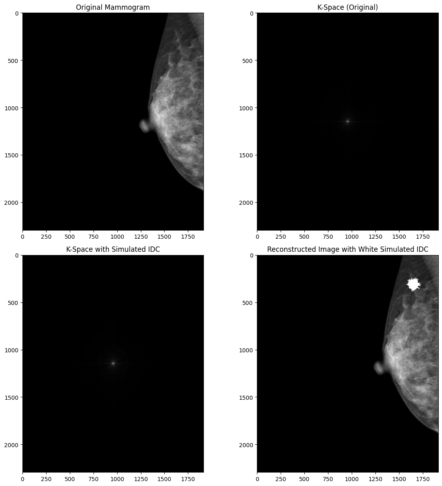
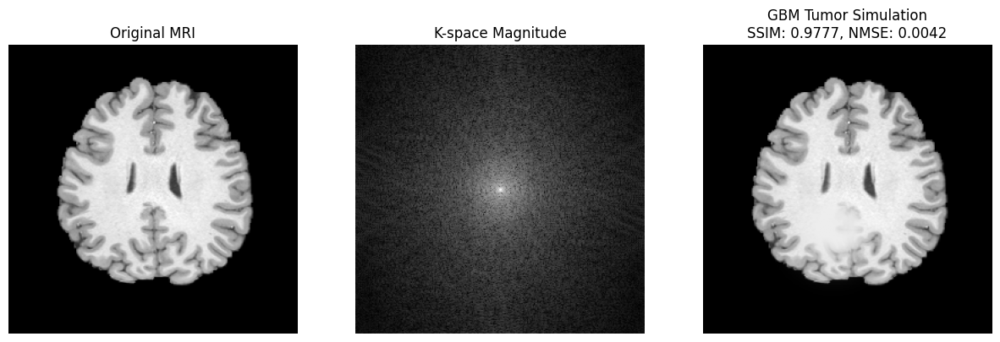

# Synthesising pathological medical images for low-resourced settings

Procedural models that add simulated pathology to healthy mammograms and brain MRI
slices, so that labelled "diseased" examples can be produced where real ones are scarce.
Developed by Oluwasegun Isaac Oyekunle as a DATICAN Scholar (Data Science and Medical
Image Analysis Training for Improved Health Care Delivery in Nigeria, NIH-funded).

| Mammography: simulated invasive ductal carcinoma | Brain MRI: simulated glioblastoma |
|---|---|
|  |  |

## What is in this repository

| File | Contents |
|---|---|
| `notebooks/mammography_synthesis.ipynb` | Simulated invasive ductal carcinoma (spiculated mass), benign cyst and mucinous carcinoma on a mammogram; batch generation of 100 synthetic images |
| `notebooks/brain_mri_synthesis.ipynb` | Simulated brain lesions and glioblastoma-like tumours on an axial T1-weighted slice, with SSIM and NMSE; k-space experiments; Gaussian-process reconstruction of undersampled k-space |
| `figures/` | Sample outputs taken from the notebooks |
| `requirements.txt` | Python packages used |

Both notebooks are exploratory: they keep the successive variants that were tried, in the
order they were tried, with their outputs.

## Method

1. **Load and normalise** the source image (DICOM mammogram, or one axial slice of a NIfTI
   T1-weighted volume) to the range 0 to 1.
2. **Build a lesion mask** procedurally, with no training step:
   - *Invasive ductal carcinoma*: a spiculated mass drawn as randomised radial spikes,
     then blurred and thresholded.
   - *Cyst* and *mucinous carcinoma*: blurred discs, darker (fluid) or lighter with a faint halo.
   - *Brain lesions and glioblastoma*: several overlapping Gaussian blobs, with optional
     necrotic core, peritumoural oedema, finger-like extensions and a small mass-effect shift.
     One variant draws the lesion radius and contrast from normal and beta distributions.
3. **Blend** the mask into the image: `image * (1 - mask) + intensity * mask`
   (or additive blending for the mammography lesions), at a random position inside the tissue.
4. **Fourier domain.** The image is transformed to k-space with a 2D FFT and displayed.
   In the mammography notebook this is a forward and inverse transform for inspection.
   The MRI notebook also tries inserting the lesion directly in k-space.
5. **Metrics (MRI).** SSIM and NMSE are computed between the source slice and the
   synthetic slice. They measure how much of the original anatomy is preserved after the
   lesion is added; they are not a comparison against real pathological scans.

The final section of the MRI notebook reconstructs an 8-fold undersampled k-space image
with the Gaussian-process (Bayesian) method of Xu et al., reaching SSIM 0.92 against
0.50 for zero-filling on the example slice.

## Running the notebooks

The notebooks were written for Google Colab. Install the packages with
`pip install -r requirements.txt`, then change the file paths near the top of each
notebook (they currently point at a Google Drive folder) to your own copies of the data.

The MRI notebook also needs the `utils`, `Boston_GPR_dictionary` and `Undersampled-Path`
folders from the KspaceMRIBO repository (see Acknowledgements).

## Data

No image data is distributed with this repository.

- **Mammography:** one mammogram in DICOM format (`mammo.dcm`). Source: [ADD DATASET NAME AND LINK].
- **Brain MRI:** one T1-weighted volume, `T1w_acpc_dc_restore_brain.nii`
  (260 x 311 x 260 voxels, 0.7 mm isotropic). Source: [ADD DATASET NAME AND LINK].

## Known limitations

- Each notebook works from a single source image.
- Lesion shapes and intensities are hand-designed, and have not been rated by radiologists.
- In the mammography batch cells, the white marker dot is drawn with its x and y
  coordinates swapped, so it does not sit on the lesion.
- Some MRI variants are kept for the record although their output is poor
  (for example the Perlin-noise and first k-space variants).

## Publications

- *Computational Model for Synthesizing Pathological Brain Magnetic Resonance Images in
  Low-Resourced Countries Towards Improved Healthcare Delivery.* Ajayi Crowther Journal of
  Pure and Applied Sciences. https://acjpas.acu.edu.ng/index.php/acjpas/article/view/214
- *A Computational Model for Synthesizing Pathological Mammography Images in
  Low-Resourced Countries Towards Improved Healthcare Delivery.* NIPES Journal of Science
  and Technology Research. https://doi.org/10.37933/nipes/7.4.2025.SI140

## Acknowledgements

- DATICAN, and my supervisors Prof. Benjamin Aribisala and Prof. Samson Arekete.
- The k-space preprocessing, helper functions and Gaussian-process reconstruction code are adapted from **KspaceMRIBO** (https://github.com/yihonglilyxu/KspaceMRIBO), 
- Fourier transforms use the `fastMRI` library.
